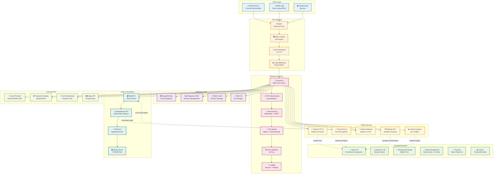
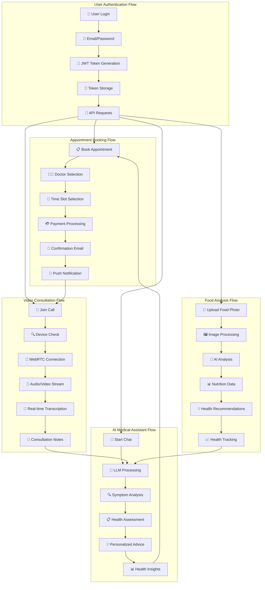
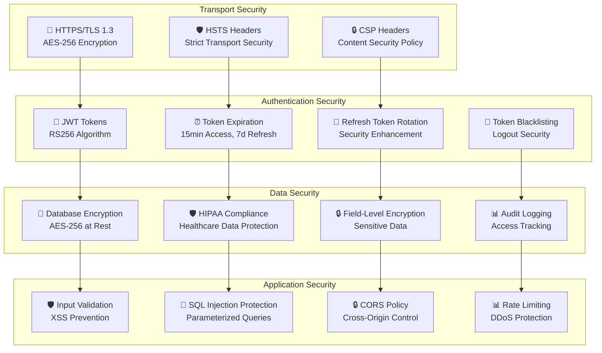
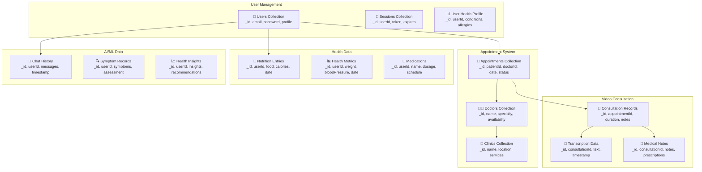
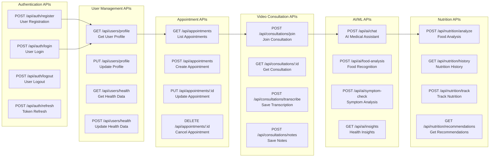

# SageCare 2.0 - Detailed Architecture Diagram

## 🏗️ Detailed System Architecture

## 🔄 Detailed Data Flow

## 🛡️ Security Implementation Details

## 📊 Database Schema Design

## 🔧 API Endpoints Architecture

---

## **📋 Detailed Architecture Summary**

### **🎯 Technology Stack**
- **Frontend**: React 18, Material-UI v5, React Query, React Router v6
- **Backend**: Node.js, Express.js, JWT, Nodemailer, Multer
- **Database**: MongoDB Atlas, Mongoose ODM, Redis Cache
- **Video**: WebRTC, Socket.io, MediaStream API
- **AI/ML**: OpenAI GPT-4, TensorFlow.js, OpenAI Whisper, Medical NLP
- **Infrastructure**: Nginx, AWS S3, Firebase FCM, SendGrid

### **🔧 Implementation Details**
- **Authentication**: JWT with RS256, refresh token rotation
- **Security**: HTTPS/TLS 1.3, HIPAA compliance, input validation
- **Performance**: Redis caching, database indexing, CDN
- **Scalability**: Load balancing, horizontal scaling, microservices

### **📊 Data Management**
- **Schema Design**: Normalized collections with proper relationships
- **Data Security**: Field-level encryption, audit logging
- **Backup Strategy**: Automated backups, disaster recovery
- **Compliance**: HIPAA standards, data retention policies

### **🔄 Integration Points**
- **Real-time Communication**: WebRTC for video, Socket.io for signaling
- **AI Integration**: RESTful APIs for AI services
- **External Services**: Payment gateways, email providers, push notifications
- **Monitoring**: Application performance monitoring, error tracking

This detailed architecture provides comprehensive technical specifications for implementing SageCare 2.0 with enterprise-grade security, scalability, and performance. 