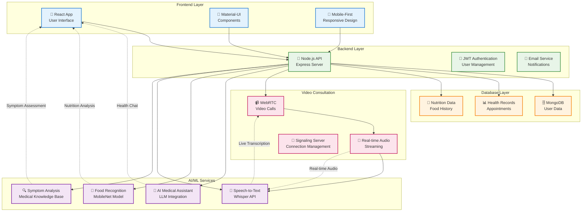
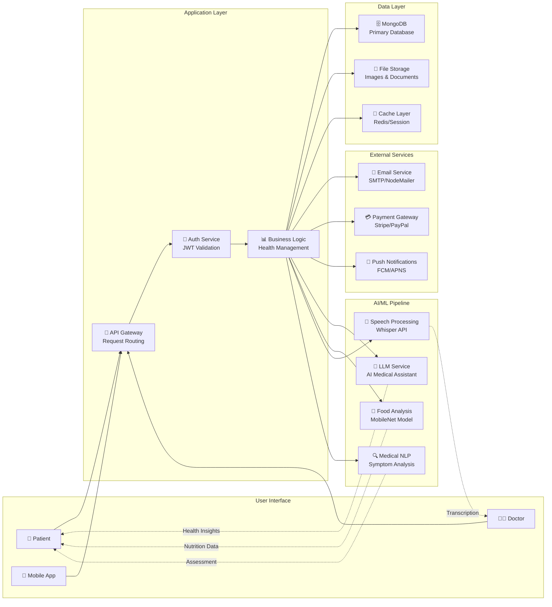
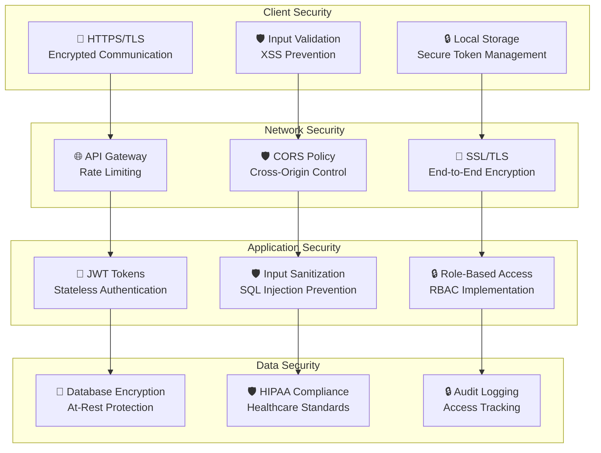
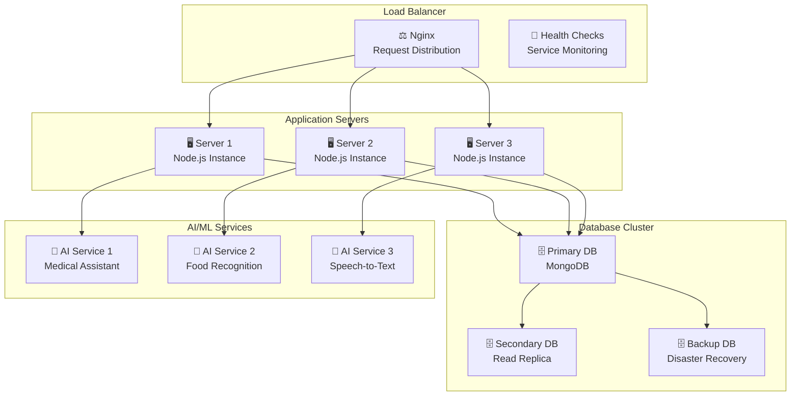

# SageCare 2.0 - High-Level Architecture Diagram

## 🏗️ System Overview

## 🔄 Data Flow Architecture

## 🛡️ Security Architecture

## 📊 Scalability Architecture

---

## **📋 High-Level Architecture Summary**

### **🎯 Core Components**
1. **📱 Frontend**: React-based responsive web application
2. **🔌 Backend**: Node.js API with Express framework
3. **🗄️ Database**: MongoDB for data persistence
4. **📹 Video**: WebRTC for real-time consultations
5. **🤖 AI/ML**: Python-based services for intelligent features

### **🔄 Key Interactions**
- **Frontend ↔ Backend**: RESTful API communication
- **Backend ↔ Database**: Data persistence and retrieval
- **Video ↔ AI**: Real-time audio streaming to speech processing
- **AI ↔ Frontend**: Intelligent insights and recommendations

### **🛡️ Security Features**
- **End-to-End Encryption**: All communications secured
- **HIPAA Compliance**: Healthcare data protection
- **JWT Authentication**: Secure user sessions
- **Input Validation**: Protection against attacks

### **📈 Scalability Design**
- **Load Balancing**: Multiple application servers
- **Database Clustering**: High availability setup
- **Microservices**: Independent AI/ML services
- **Horizontal Scaling**: Easy capacity expansion

This high-level architecture provides a clear overview of how SageCare 2.0's components interact while maintaining security, scalability, and performance. 