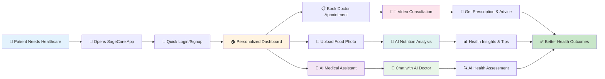
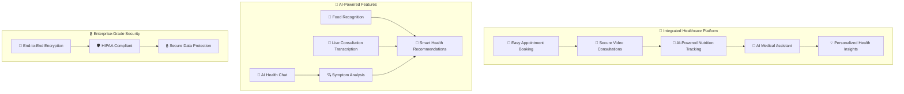
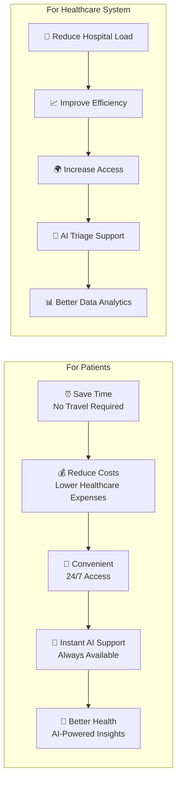
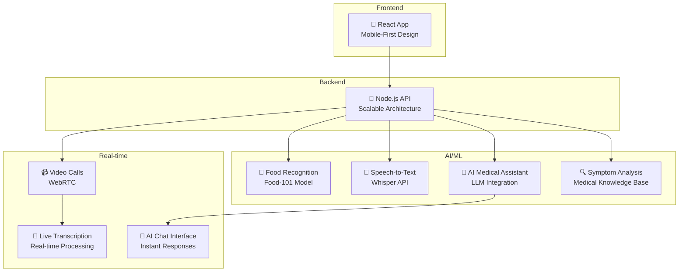
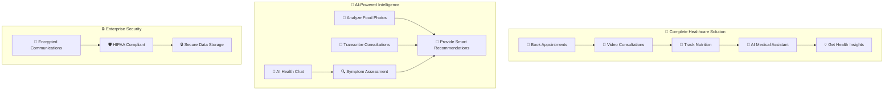

# SageCare 2.0 - High-Level User Journey Map (Showcase Version)

## 🏥 Simple User Journey Flow

## 🎯 Core Value Propositions

## 📊 Key Benefits for Users

## 🚀 Technology Innovation

## 📈 Success Metrics

```mermaid
graph LR
    subgraph "User Impact"
        U1[👥 1000+ Daily Users]
        U2[⏱️ 15+ Min Sessions]
        U3[✅ 95% Appointment Completion]
        U4[🤖 80% AI Assistant Usage]
    end
    
    subgraph "Health Outcomes"
        H1[😊 4.5/5 Satisfaction]
        H2[📊 70% Nutrition Tracking]
        H3[🤖 90% AI Chat Accuracy]
        H4[🎯 Improved Health Metrics]
    end
    
    subgraph "Technical Excellence"
        T1[🎥 99% Video Quality]
        T2[🤖 90% AI Accuracy]
        T3[💬 95% AI Response Time]
        T4[🔄 99.9% Uptime]
    end
    
    U1 --> H1
    U2 --> H2
    U3 --> H4
    U4 --> H3
    T1 --> H1
    T2 --> H2
    T3 --> H3
    T4 --> U1
```

## 🎯 What Makes SageCare Special

---

## **📋 Showcase Summary**

### **🎯 What is SageCare 2.0?**
A **comprehensive healthcare platform** that combines **telemedicine consultations**, **AI-powered nutrition tracking**, and **AI medical assistant** to provide personalized health management.

### **🚀 Key Features**
1. **📱 Easy-to-Use Interface** - Simple appointment booking and video consultations
2. **🤖 AI-Powered Nutrition** - Upload food photos for instant nutrition analysis
3. **🎥 Secure Video Calls** - High-quality consultations with real-time transcription
4. **🤖 AI Medical Assistant** - 24/7 AI health chat and symptom analysis
5. **💡 Personalized Insights** - AI-driven health recommendations and tracking

### **📊 Business Impact**
- **For Patients**: Convenient, cost-effective, 24/7 healthcare access with instant AI support
- **For Healthcare**: Reduced load, improved efficiency, AI-powered triage, better data analytics
- **For Society**: Increased healthcare access, better health outcomes, AI democratization

### **🔧 Technical Innovation**
- **Modern Tech Stack**: React, Node.js, MongoDB
- **AI/ML Integration**: Food recognition, speech-to-text, AI medical assistant, health recommendations
- **Real-time Communication**: WebRTC video calls with live transcription and AI chat
- **Enterprise Security**: HIPAA compliant, end-to-end encryption

This simplified journey map is perfect for showcasing SageCare 2.0 to stakeholders, investors, and anyone who needs to quickly understand the value proposition and capabilities of the platform. 