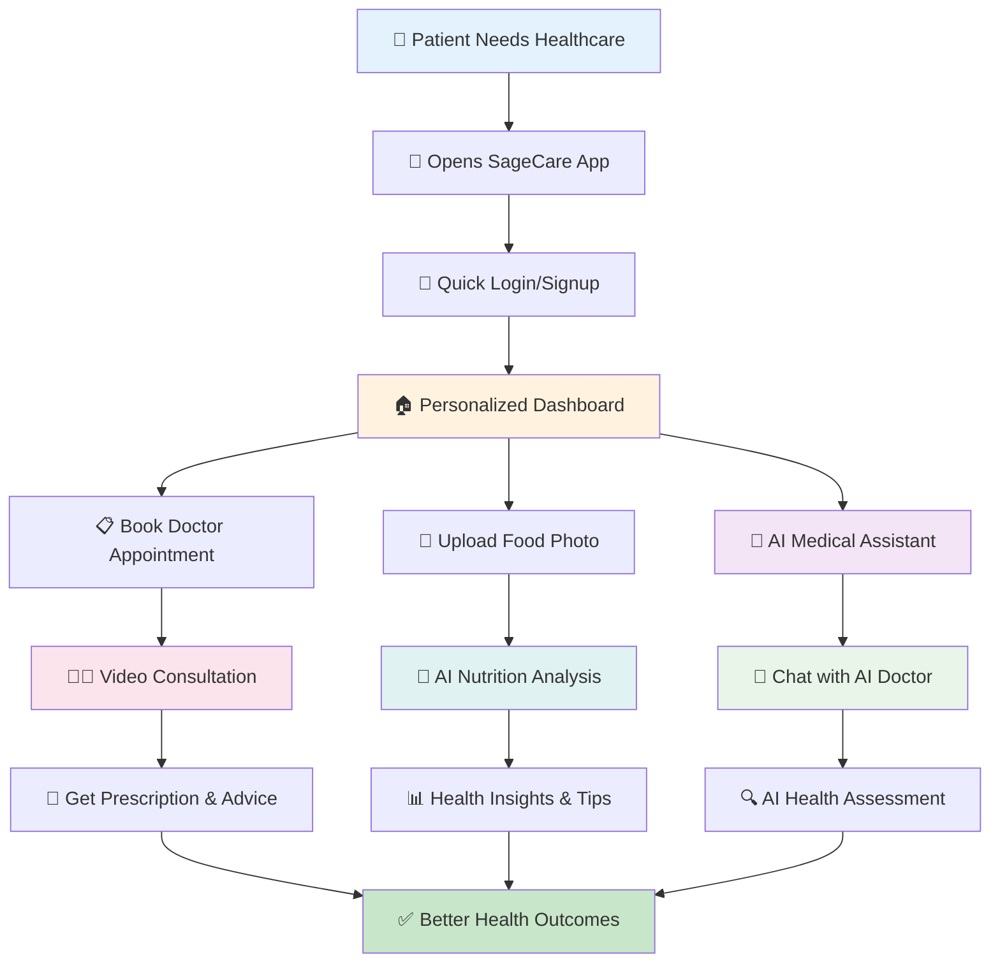
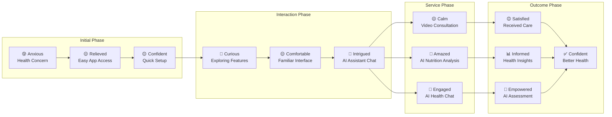
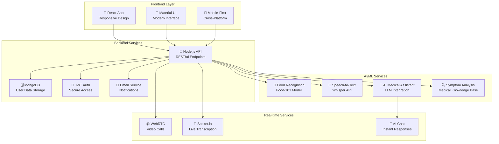
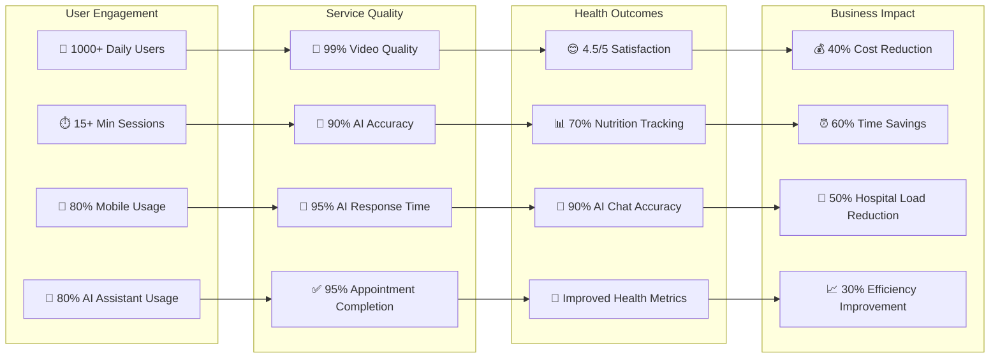
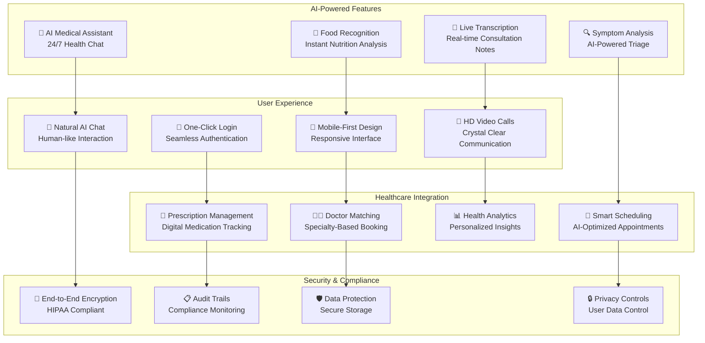

# SageCare 2.0 - Comprehensive User Journey Map

## 🏥 Main User Journey Flow

## 😊 User Emotions Throughout Journey

## 🔧 Technology Integration Points

## 📈 Success Metrics & KPIs

## 🚀 Innovation Highlights

---

## **📋 Journey Summary**

### **🎯 Key User Touchpoints**
1. **📱 App Access** - Quick, intuitive mobile interface
2. **🔐 Authentication** - Secure, one-click login process
3. **🏠 Dashboard** - Personalized health overview
4. **📋 Appointment Booking** - Easy doctor scheduling
5. **📸 Food Analysis** - AI-powered nutrition tracking
6. **🤖 AI Medical Assistant** - 24/7 health chat support
7. **🎥 Video Consultation** - High-quality doctor visits
8. **💊 Health Management** - Prescription and advice tracking
9. **📊 Insights** - AI-driven health recommendations
10. **✅ Outcomes** - Improved health and satisfaction

### **🤖 AI Integration Points**
- **AI Medical Assistant**: 24/7 health chat and symptom analysis
- **Food Recognition**: Instant nutrition analysis from photos
- **Speech-to-Text**: Real-time consultation transcription
- **Smart Recommendations**: Personalized health insights
- **Symptom Analysis**: AI-powered health assessment

### **📈 Success Indicators**
- **User Engagement**: 1000+ daily users, 15+ min sessions
- **Service Quality**: 99% video quality, 90% AI accuracy
- **Health Outcomes**: 4.5/5 satisfaction, improved metrics
- **Business Impact**: 40% cost reduction, 60% time savings

This comprehensive journey map demonstrates how SageCare 2.0 creates a seamless, AI-enhanced healthcare experience that benefits patients, healthcare providers, and the entire healthcare ecosystem. 